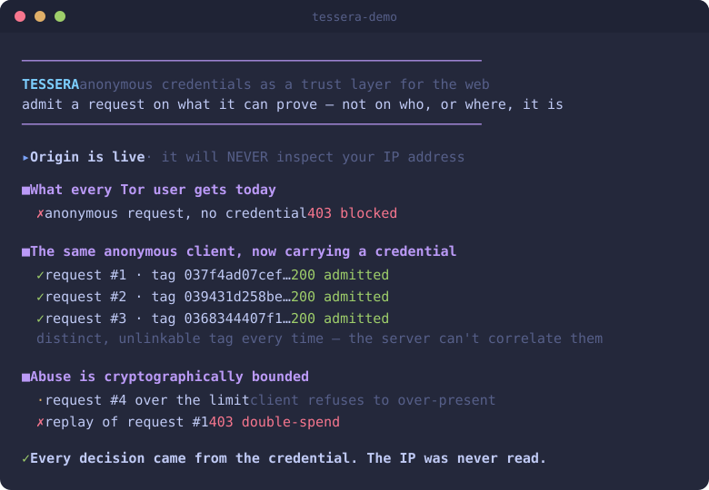

# Tessera

[](https://github.com/NubsCarson/tessera/actions/workflows/ci.yml)
[](#license)
[](#build)


**Private, uncensorable access to the clearnet — pay anonymously, per request, to reach any site without being blocked.**

Tessera began as a from-scratch, spec-faithful implementation of the IETF
**Anonymous Rate-Limited Credentials (ARC)** protocol (a *trust layer for
anonymous traffic*), and is **evolving** into a private, uncensorable
clearnet-access network — admit a request on an anonymous credential/payment,
**not** an IP. The proven ARC credential is now one component of that larger system.

> **Direction (vNext):** the full design — a ZK payment-channel rail, a
> mode-switched mixnet transport, a coherent-persona anti-fingerprint layer, and
> clean residential egress — is in [`docs/DESIGN.md`](./docs/DESIGN.md). It is
> **early/design-stage and research-grade**, honest about its limits (clean-IP
> supply, the anti-bot arms race, no post-quantum, unaudited, ~85% prior art).
> This direction pursues privacy-preserving **circumvention** — a deliberate
> evolution beyond v0's "obsolescence, not evasion" framing.

> A **tessera** was a small token used in ancient Rome as a ticket of
> admission — proof you were allowed in, carried in the hand, tied to no name.
> That is exactly what this is: a cryptographic token that admits a request on
> its own merit, not on who or where it came from.

## See it



```sh
cargo run -p tessera-demo            # real HTTP origin + client, localhost
cargo run -p tessera-demo -- --tor   # also drive it over a real Tor onion circuit
```

The demo stands up an origin guarded by `tessera-origin`, issues a credential to
a `tessera-client`, and makes **real HTTP requests**: no credential → `403`
(what every Tor user gets today); with a credential → `200` and a fresh,
unlinkable tag each time; over the limit → the client refuses; a replay → `403`
double-spend. The origin never reads the source IP. See [`DEMO.md`](./DEMO.md).

### Use Claude (or any HTTPS site) through Tor, gated on a credential

```sh
cargo run -p tessera-proxy            # or: -- --tor  (tunnel via Tor at :9050)
```

`tessera-proxy` is a forward **`CONNECT`** proxy that admits a request only if it
carries a valid Tessera credential — **never on its IP** — then tunnels it to any
HTTPS endpoint (your TLS stays end-to-end; the proxy never sees plaintext),
optionally over Tor. Point a normal client at it; no credential → `407`. It
prints a ready-to-run `curl` for the Anthropic API. This is the original goal,
end to end: anonymous, accountable, IP-blind access to Claude over Tor.

## The problem it attacks

The web decides whether to trust you by your **IP address**. Tor's exit relays
are published and deterministically blockable, so anonymous traffic is treated
as guilty by default — blocked, CAPTCHA-walled, or rate-limited into
uselessness. Throwing more crypto at *hiding that you're Tor* is a losing
arms race, and it's the wrong layer: the server sees a source IP no matter what.

Tessera changes the trust primitive instead. A client obtains an **ARC
credential** and presents it with each request. The server learns only:

- this presentation came from *some* validly-issued credential, and
- it is within that credential's fixed presentation budget,

…and **nothing else** — not the client's identity, not which credential it is,
and no two presentations are linkable to each other or to issuance. The server
can now rate-limit and trust anonymous clients **without IP reputation**, so it
has no reason to block Tor. Censorship by IP becomes obsolete rather than evaded.

This is the missing adapter between Privacy-Pass-style anonymous credentials
and anonymity networks — see [`GOAL.md`](./GOAL.md) for the full thesis and
roadmap.

## Crates

A Cargo workspace of six crates — a verifiable crypto core plus the tooling
around it:

| Crate | What it is |
|-------|-----------|
| [`tessera-arc`](./crates/tessera-arc) | The cryptographic core: ARC over P-256 — group/hashing, issuance, presentation + integrated range proof, the SHAKE128 Fiat-Shamir / Sigma proofs, wire serialization, and the double-spend tag store. Proven against the IETF test vectors. |
| [`tessera-issuer`](./crates/tessera-issuer) | Proof-of-work **issuance gate** ("earn your budget") — makes minting a credential cost CPU. A cost knob, not strong Sybil resistance. |
| [`tessera-origin`](./crates/tessera-origin) | Server-side `OriginGuard`: admit a request on a valid, in-budget, unspent presentation — **never** on the source IP. Transport-agnostic. |
| [`tessera-client`](./crates/tessera-client) | Holds a credential and mints one fresh, unlinkable presentation per request. |
| [`tessera-proxy`](./crates/tessera-proxy) | A credential-gated `CONNECT` proxy: IP-blind, TLS-end-to-end access to any HTTPS site (the Anthropic API included), optionally over Tor. |
| [`tessera-demo`](./crates/tessera-demo) | The runnable end-to-end demo: narrated CLI, a `--serve` browser hub, and a `--tor` onion-service path. |

Plus an out-of-workspace wasm client (its own excluded workspace, like `fuzz/`):

| Crate | What it is |
|-------|-----------|
| [`tessera-wasm`](./crates/tessera-wasm) | `wasm-bindgen` browser bindings: real issuance (`prepare_issuance`) + `present()` in-browser. **Compiles to `wasm32`**, headless node tests pass, and a wasm-issued credential is **verified to interoperate with the Rust origin** (`examples/node-real-issuance.cjs`). Ships an MV3 [extension scaffold](./crates/tessera-wasm/extension) — loading it in an actual browser is the human final mile. |
| [`tessera-tower-demo`](./crates/tessera-tower-demo) | A runnable **`axum` server** using the `tessera-origin` `tower` middleware. `cargo run` it and `curl` the printed commands; its end-to-end test drives a real server on a multi-threaded `tokio` runtime over a real socket (admit / malformed / replay / fresh). |

> Not yet published to crates.io — every crate is `publish = false` pending a
> third-party security audit. Use it via a git or path dependency for now.

## Standards

Tessera tracks three IETF drafts and is validated against their official test
vectors:

- [`draft-ietf-privacypass-arc-crypto-01`](https://datatracker.ietf.org/doc/draft-ietf-privacypass-arc-crypto/) — the ARC protocol (Yun, Wood, Faz-Hernández)
- [`draft-irtf-cfrg-sigma-protocols-01`](https://datatracker.ietf.org/doc/draft-irtf-cfrg-sigma-protocols/) — the zero-knowledge proof system
- [`draft-irtf-cfrg-fiat-shamir-01`](https://datatracker.ietf.org/doc/draft-irtf-cfrg-fiat-shamir/) — the non-interactive transform

## Status

| Layer | State |
|-------|-------|
| P-256 group / hashing / serialization | ✅ proven against IETF vectors |
| Server key generation | ✅ proven against IETF vectors |
| Issuance & presentation arithmetic | ✅ proven against IETF vectors |
| Fiat-Shamir + Sigma proofs | ✅ verifier proven against authoritative Sigma vectors; prover exercised via end-to-end round-trip † |
| Full ARC API (issue / present / verify) + range proof + double-spend store | ✅ end-to-end round-trip proven |
| `tessera-issuer` — proof-of-work issuance gate ("earn your budget") | ✅ cost-gate (not strong Sybil resistance — see threat model) |
| `tessera-proxy` — credential-gated CONNECT proxy (use Claude/any HTTPS through Tor) | ✅ admit on credential not IP; TLS tunneled end-to-end |
| `tessera-origin` guard + `tessera-client` (real HTTP demo) | ✅ admit/reject tested; IP never read |
| `tessera-origin` optional `tower` middleware (`TesseraLayer`) | ✅ feature-gated drop-in `Layer`; proven in a real `axum` server over a real socket (`tessera-tower-demo`) — admit/malformed/replay/fresh |
| `tessera-origin` pluggable spent-tag store (`SpentTagStore`) | ✅ in-memory default + durable `FileTagStore`; double-spend survives a guard restart (tested) |
| Tor binding (onion-service end-to-end) | ✅ implemented; live circuit needs host Tor egress |
| Hardening — CT fix, fuzzing, benches, threat model | ✅ internal audit applied ([`docs/THREAT_MODEL.md`](./docs/THREAT_MODEL.md)); **not** third-party audited |

† The ARC §10.2 *proof* blobs are not byte-reproducible from the pinned
reference (an upstream vector inconsistency — the ARC *arithmetic* vectors all
pass; see [`docs/ARC_PROOF_VECTOR_DISCREPANCY.md`](./docs/ARC_PROOF_VECTOR_DISCREPANCY.md)).
The Fiat-Shamir layer is instead proven against the authoritative IETF Sigma
Protocol test vectors, which exercise the identical transcript machinery.

The crate currently proves the entire **arithmetic core** of ARC matches the
reference byte-for-byte (`tests/test_vectors.rs`; the full crate has many more
tests — round-trip, wire, sigma-vector, proof, and robustness suites):

```
$ cargo test -p tessera-arc --test test_vectors
running 8 tests
test generator_h_is_deterministic ... ok
test server_public_key_matches_vectors ... ok
test hash_to_scalar_matches_m2 ... ok
test credential_request_encryptions_match ... ok
test credential_response_arithmetic_matches ... ok
test finalize_credential_matches ... ok
test presentation1_arithmetic_matches ... ok
test presentation2_arithmetic_matches ... ok
```

## ⚠️ Security status — read this

This is **research-grade, draft-tracking code**. It has **not** been
third-party audited; the known secret-dependent path (the range-proof bit
decomposition) is constant-time-hardened via `subtle`, but there has been **no
end-to-end constant-time audit**; and the underlying specs are IETF *drafts*
that may change. **Do not use it to protect real users yet.** The
path to that is milestone 10 in [`GOAL.md`](./GOAL.md). The cryptographic
primitives come from the audited [RustCrypto](https://github.com/RustCrypto)
project; the protocol logic on top is what still needs review.

To report a vulnerability, see [`SECURITY.md`](./SECURITY.md). The full trust
model, per-goal guarantees, and known gaps are in
[`docs/THREAT_MODEL.md`](./docs/THREAT_MODEL.md).

## Documentation

| Doc | What's in it |
|-----|--------------|
| [`docs/DESIGN.md`](./docs/DESIGN.md) | **vNext** — the full private-uncensorable-access design: ZK payment-channel rail, mixnet transport, anti-fingerprint, clean egress, the open frontier (cross-epoch anonymity) and honest ceilings. The live direction. |
| [`GOAL.md`](./GOAL.md) | The v0 thesis, the 10-milestone Definition of Done (all met), and deliberately-deferred future work. |
| [`DEMO.md`](./DEMO.md) | How to run and read the demo, including the `--tor` onion path. |
| [`docs/THREAT_MODEL.md`](./docs/THREAT_MODEL.md) | Trust model, per-goal guarantees, threat actors, non-goals, known weaknesses, deployment guidance. |
| [`docs/SECURITY_ARGUMENT.md`](./docs/SECURITY_ARGUMENT.md) | Per-property argument: construction → assumption → gap to a formal proof. An auditor's map. |
| [`docs/ROADMAP.md`](./docs/ROADMAP.md) | The post-v0 frontier — audit-readiness, deployable middleware, WASM client, upstream + PQ research. |
| [`SECURITY.md`](./SECURITY.md) | Vulnerability disclosure policy + in/out of scope. |
| [`docs/ARC_PROOF_VECTOR_DISCREPANCY.md`](./docs/ARC_PROOF_VECTOR_DISCREPANCY.md) | The one known upstream vector inconsistency, with full reproduction. |
| [`CONTRIBUTING.md`](./CONTRIBUTING.md) | The contribution bar + the exact CI gate commands. |
| [`CHANGELOG.md`](./CHANGELOG.md) | Notable changes. |

## Build & run

Requires a stable Rust toolchain (MSRV **1.74**).

```sh
# verify — the same gates CI runs
cargo test --workspace --all-features --locked
cargo clippy --workspace --all-targets --all-features --locked -- -D warnings
cargo fmt --all -- --check

# run it
cargo run -p tessera-demo             # narrated end-to-end demo
cargo run -p tessera-demo -- --serve  # browser hub at http://127.0.0.1:8088 (auto-opens)
cargo run -p tessera-demo -- --tor    # also drive a real Tor onion circuit
cargo run -p tessera-proxy            # credential-gated CONNECT proxy (Claude over Tor)

# fuzz — nightly + `cargo install cargo-fuzz`
cargo +nightly fuzz run wire_from_bytes -- -max_total_time=30
```

## License

Dual-licensed under [MIT](./LICENSE-MIT) or [Apache-2.0](./LICENSE-APACHE), at
your option — the Rust ecosystem standard.
